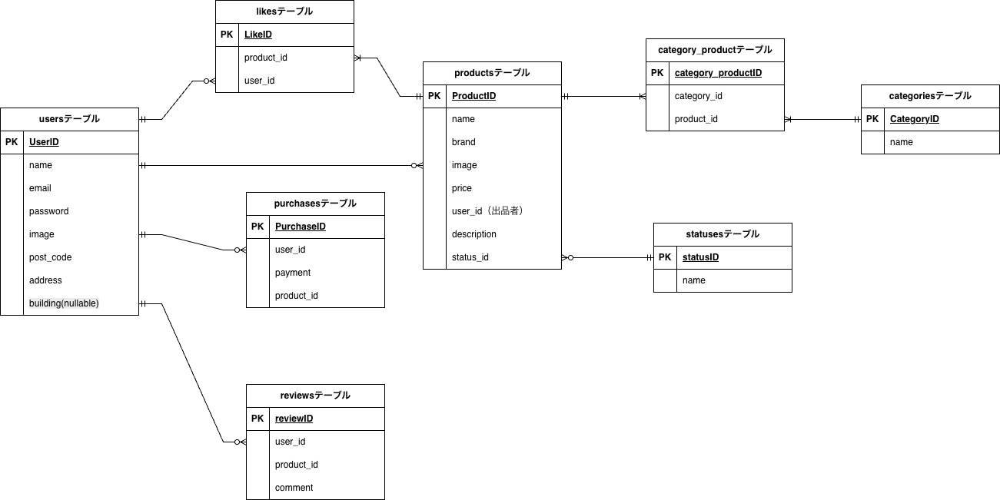

## 1.アプリケーションの概要

#### 1. アプリケーション名

　 フリマアプリ

#### アプリケーションでできること

- 商品の閲覧
- 商品詳細
- 商品検索
- 商品の購入
- 商品の出品


## 2.主要技術

| 言語・フレームワーク　 | バージョン |
| -------------------- | ---------- |
| nginx                | 1.21.1     |
| MySQL                | 8.0.26     |
| phpmyadmin           | latest     |
| Laravel              | 8.83.29    |
| Docker               | 28.0.4,    |


## 3.開発環境構築方法

#### 1. Docker と Docker Compose のインストール

Docker と Docker Compose をインストールしてください。インストール方法は公式ドキュメントを参照してください。


#### 2. リポジトリの設定

開発環境をGithubからクローン<br />
(例)coachtech/laravelディレクトリ以下にクローン　→　リポジトリ名を「20260111mock-project1_endou」に変更
```
 cd coachtech/laravel
```

```
 git clone git@github.com:Endou9527/mock-project1.git
```

```
 mv mock-project1 20260111mock-project1_endou
```

```
 cd 20260111mock-project1_endou
```


#### ３. Dockerの設定

※カレントディレクトリは20260111mock-project1_endouで
```
 docker-compose up -d --build
```
```
 code .
```
Dockerコンテナが作成されているかどうか確認してください


#### 2. Laravelパッケージのインストール

PHPコンテナへログイン

```
docker-compose exec php bash
```

パッケージのインストール

```
composer install
```


#### ４. .envファイルの作成

.env.exampleをコピー　→　「.env」へファイル名変更
```
cp .env.example .env
```


```
// 前略

DB_CONNECTION=mysql
- DB_HOST=127.0.0.1
+ DB_HOST=mysql
DB_PORT=3306
- DB_DATABASE=laravel
- DB_USERNAME=root
- DB_PASSWORD=
+ DB_DATABASE=laravel_db
+ DB_USERNAME=laravel_user
+ DB_PASSWORD=laravel_pass

// 後略

```


アプリケーションキーを生成

```
php artisan key:generate
```


## ５.その他特記事項

### ルーティング

  | ページ　                       　　　　| ルーティング                  　 |
  | ----------------------------- | --------------------------- |
  | 商品一覧画面(トップ画面)          | /register                   |
  | 商品一覧画面(トップ画面)_マイリスト | /?tab=mylist                |
  | 会員登録画面                    | /register                   |
  | ログイン画面　　                 | /login                      |
  | 商品詳細画面                    | /item/{item_id}　　          |
  | 商品購入画面　　                 | /purchase/{item_id}         |
  | 住所変更ページ                   | /purchase/address/{item_id} |
  | 商品出品画面  　　               | /sell                       |
  | プロフィール画面  　　            | /mypage                     |
  | プロフィール編集画面  　　         | /mypage/profile             |
  | プロフィール画面_購入した商品一覧   | /mypage?page=buy            |
  | プロフィール画面_出品した商品一覧   | /mypage?page=sell           |
  <br /> 
  <br />
  <br />

### ER図
　　
  <br /> 
  <br />
  <br />  

### 画像情報


### その他補足事項
  ####　なし

### URL
https://github.com/Endou9527/mock-project1# mock-project2
